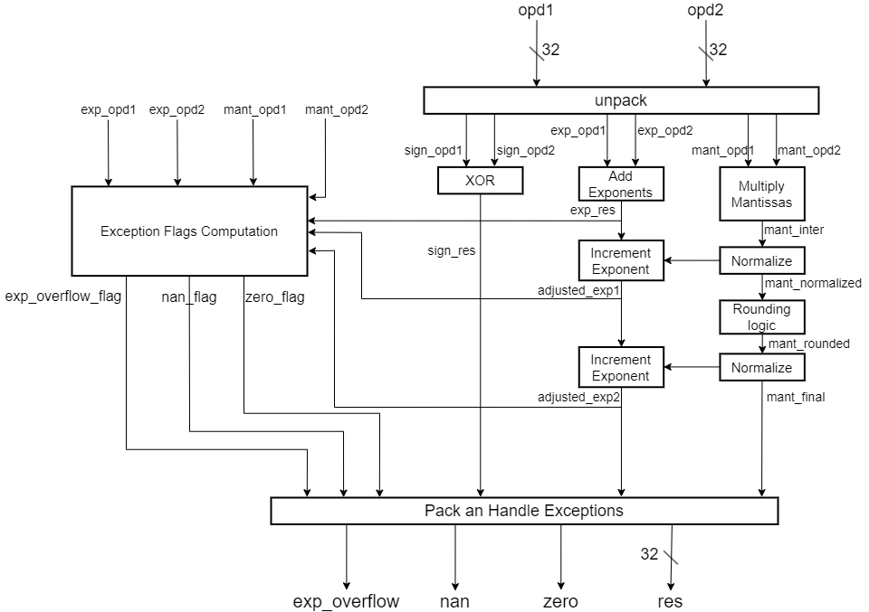
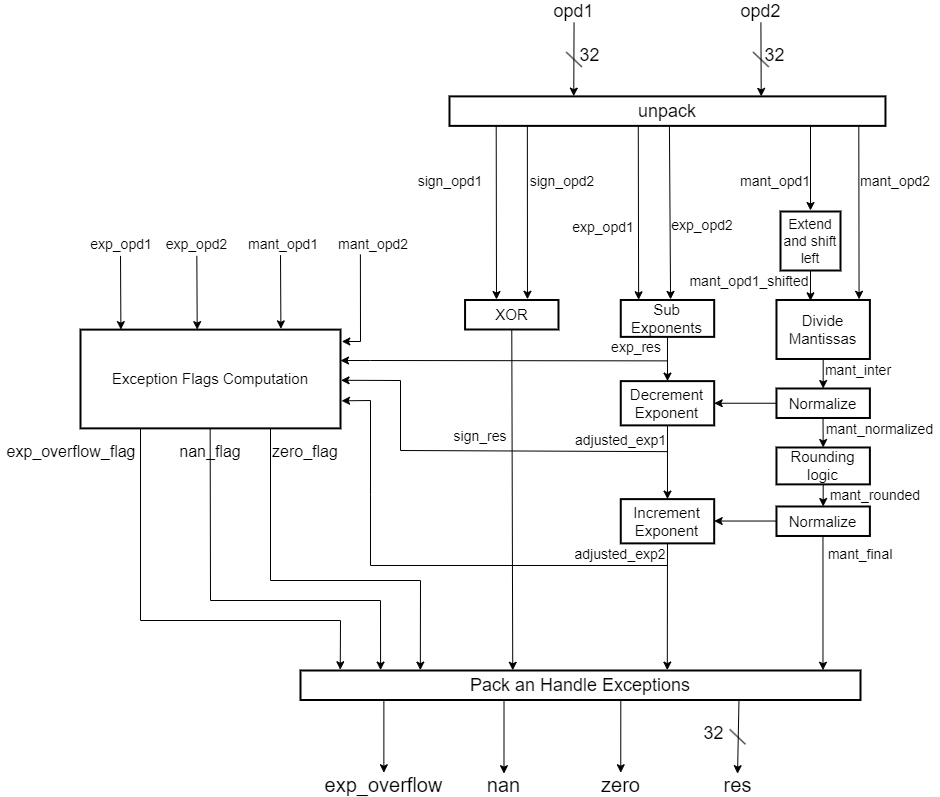

# Floating-Point Unit (FPU)

This repository contains a synthesizable SystemVerilog implementation of a 32-bit Floating-Point Unit (FPU). The project includes testbenches and schematics for all components that make up the FPU.

## Features

The FPU supports the following operations:
- **Addition**
- **Subtraction**
- **Multiplication**
- **Division**

### Rounding Method
- Implements the **round-to-nearest-even** technique.

### Exception Handling
- Detects and handles the following special cases:
  - **Overflow**
  - **Underflow**
  - **Zero**
  - **NaN** (Not a Number)


## How to Run

The subcomponents (e.g., floating-point adder/subtractor, multiplier, and divider) were tested individually before being integrated into the FPU. Testbenches are provided for each subcomponent as well as for the complete FPU. A set of scripts has been created to run these testbenches. Follow the steps below to execute these scripts:

### Steps to Run Testbenches in ModelSim
1. Open the ModelSim terminal.
2. Navigate to the `fpu_design/` directory:
   ```
   cd fpu_design/
   ```
3. Run the desired testbench script using the following commands:
- For the floating-point adder/subtractor:
  ```
  do ./scripts/simulate_fp_add_sub.tcl
  ```
- For the floating-point multiplier:
  ```
  do ./scripts/simulate_mul.tcl
  ```
- For the FPU:
  ```
  do ./scripts/simulate_fpu.tcl
  ```


## FPU Architecture

### Ports of the FPU
- **opd1**: First operand  
- **opd2**: Second operand  
- **op**: Operation selector:  
  - `00`: Addition  
  - `01`: Subtraction  
  - `10`: Multiplication  
  - `11`: Division  
- **exp_overflow**: Overflow flag, raised in case of an exponent overflow  
- **exp_underflow**: Underflow flag, raised in case of an exponent underflow  
- **nan**: Not a Number (NaN) flag  
- **zero**: Zero flag 

The FPU consists of three main submodules:
1. **Floating-Point Adder/Subtractor**  
2. **Floating-Point Multiplier**  
3. **Floating-Point Divider**  

All three submodules are instantiated within the FPU. A set of multiplexers (MUXes) is used to route the correct inputs and outputs to and from these submodules based on the `op` input signal. This design enables the FPU to dynamically select the appropriate operation. The FPU architecture can be seen in the following figure:


When not in use, the operands of a unit are set to 0 to minimize switching power. The output features four multiplexer pairs that select between the outputs of the three submodules.


## Floating-Point Adder/Subtractor Architecture
The Floating-Point Add/Sub consists of two main submodules:
1. **Barrel Shifter (R_Shifter, L/R1-Shifter)**  
2. **Leading-Zeros Counter (LZC)**  

The architecture of the FP add/Sub can be seen in the following figure:


The algorithm followed by the FP Add/Sub is:
1. Compute the Effective Operation (EOP), which can be an addition or subtraction.
2. Compute the difference between the exponents, take the larger exponent as the tentative exponent of the final result. 
3. Swap the input operands if necessary, based on the sign of the exponent difference.
4. Right shift the significand of the operand with the smaller exponent through a number of bits equal to the exponent difference.
5. Add or subtract the two significands, based on the EOP.
6. Normalize the result, this step is executed based on EOP:
   - EOP is addition: there might be an overflow of the result, right shift by one position to normalize the result, increament the tentative exponent.
   - EOP is Subtraction: the result might have leading zeros. Left shift by a number of positions equal to the number of leading zeros, decrement the tentative exponent by the same number. The number of leading zeros is computed by the LZC.
7. Round the normalized result based on the **round-to-nearest-even** technique.
8. The rounding might cause an overflow of the result, if true normalize again by shifting right by one position, increment the tentative exponent.
9. During all these steps, a number of signals are being monitored and checked for any exception or special case. If any exception or special case is detected, the corresponding flag is raised and the result is set accordingly. For example if one of the operands is NaN, the NaN flag is raised and the result is set to Nan regardless of the second operand.

### Barrel Shifter

The barrel shifter is used in the FP add/sub to normalize the results. Its architecture is seen in the following figure:


It follows the standard architecture of a right barrel shifter, with additional multiplexers in the first and last layers to enable support for left shifting as well. For left shifting, the first layer of multiplexers inverts the input data, such that the MSB becomes the LSB, the MSB-1 becomes LSB+1, and so on. The last layer then reverses this inversion, restoring the data to its original format. By applying this inverse-shift-right-inverse process, we effectively perform a left shift.

### LZC

The design of the Leading-Zero Counter (LZC) is based on the paper by [Miao, Jia and Li, Shuguo](https://ieeexplore.ieee.org/document/8355536) - *A design for High Speed leading-Zero Counter* (2017)
The 32-bit LZC uses four 8-bit LZC as its basic component unit as seen in the following figure:


Some changes were made to the 32-bit LZC compared to the original implementation in the paper: the OR gate that generates Z[4] was replaced with an AND gate, and the AND_NOR module was replaced with a different logic to compute Z[3]. The architecture of the 8-bit LZC is shown in the following figure. No modifications were made; it is the same as presented in the paper.


### Carry Skip Adder

The carry skip adder is used to add or subtract the significands, referred to in the block diagram as "Add/Sub". It was chosen instead of a ripple carry adder to reduce latency. Its architecture is seen in the following figure:


RCB stands for Ripple Carry Block, it is a block made out of 4 Full Adders (FA) where the carry is propagating trough all 4 FAs, The p signal controlling the multiplexers stands for propagate, it is computed as the AND of 4 p signals generated by each FA as seen below:


If all four p signals are asserted (logic 1), there is no need to wait for the carry to propagate through the four FAs. It is already determined that these adders will exclusively propagate the incoming carry without generating or blocking it. 

## Floating-Point Multiplier Architecture

The architecture of the FP multiplier is seen in the following figure:



The algorithm adopted by the FP multiplier is:
1. Computed the sign of the result by simply XORing the sign of the operands.
2. Add the exponents, the result is considered a tentative exponent for the final exponent value.
3. Multiply the mantissas
4. There might be an overflow of the result, if true normalize the result. Normalization is done by right shifting by one position, increment the tentative exponent if right shifted.
5. Round the normalized result based on the **round-to-nearest-even** technique.
6. The rounding might cause an overflow of the result, if true normalize again by shifting right by one position, increment the tentative exponent.
7. During all these steps, a number of signals are being monitored and checked for any exception or special case. If any exception or special case is detected, the corresponding flag is raised and the result is set accordingly.

Currently, the multiplication of the mantissas is implemented using the '*' operator. I may implement a more sophisticated multiplier in the future.


## Floating-Point Divider Architecture

The architecture of the FP divider is seen in the following figure:



It follows the same algorithm as the FP multiplier, with the main differences being the subtraction of exponents instead of addition, and dividing the mantissas instead of multiplying them.
